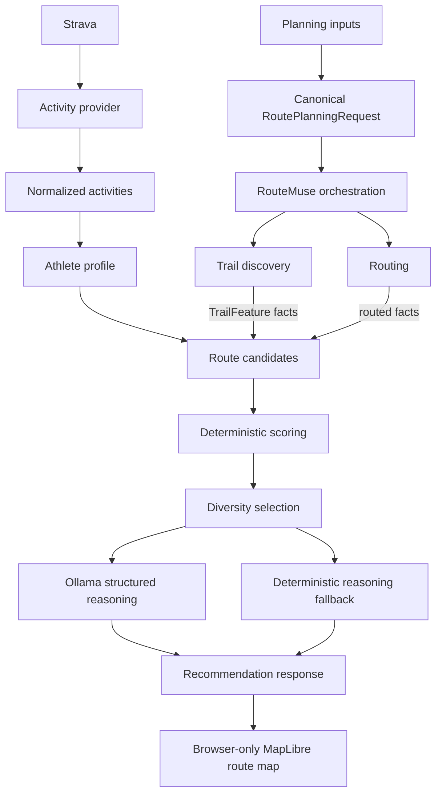

# Architecture

RouteMuse is a modular monolith with a typed Next.js UI, a FastAPI application, and PostgreSQL/PostGIS. Provider contracts form narrow seams around external systems.

## RouteMuse domain

RouteMuse owns the vocabulary used by the rest of the application: `ActivityKind`, normalized activities, `AthleteProfile`, `RoutePlanningRequest`, `RouteCandidate`, and recommendation concepts. These models use canonical meters and seconds and must not mirror a provider payload merely for convenience. Presentation code owns user-facing unit conversion. The planning request is documented in [Canonical route-planning request](planning.md).

## Integration boundaries

**Location geocoding.** The existing `GeocodingProvider` contract exposes a multi-result search returning RouteMuse-owned `PlanningArea` values. A planning area carries validated WGS84 point coordinates, a display name, optional provider-supplied bounds, provider identification, and required attribution. Pelias FeatureCollections and provider field names remain inside the OpenRouteService adapter; raw payloads are neither exposed nor persisted. The API key is server-owned and checked only when search is invoked. The planner keeps the selected normalized value in component/session state and displays its attribution. Geocoding, discovery, and round-trip generation are available now, while map rendering remains future work.

**Strava.** Strava is an external activity-data provider, not the owner of RouteMuse's taxonomy. The OAuth HTTP client and provider DTOs stay inside `backend/app/integrations/strava/`. The API initiates authorization, validates a short-lived HttpOnly state cookie, checks the actually granted `activity:read_all` scope, exchanges codes server-side, and exposes only token-free status. A centralized lifecycle service obtains usable access tokens and persists refresh-token rotation under a database row lock. The activity boundary classifies the provider's exact `sport_type` values through an explicit mapping; unsupported values retain their original provider value and do not produce a RouteMuse activity. The synchronization service converts required IANA-timezone calendar ranges into UTC provider bounds, retrieves typed pages sequentially, delegates token refresh to that lifecycle service, and commits idempotent upserts one page at a time. Provider-specific fields do not leak into domain logic. Athlete-profile requests are RouteMuse application endpoints: they query canonical persisted rows and never call Strava.

**Geospatial and routing providers.** External systems own factual trail and route information. Discovery accepts a bounded `RouteDiscoveryRequest` and returns factual `TrailFeature` values; a discovered way or named-route relation is not a generated candidate. Routing accepts the narrower `RoutingRequest`, in either waypoint or seeded round-trip mode, and returns `RouteCandidate`. RouteMuse orchestration translates supported loop `RoutePlanningRequest` inputs into bounded, sequential routing requests; Overpass discovery remains independent of routing geometry. Adapters normalize geometry, distance, elevation, surface, way type, access, technical distributions, and confidence without leaking raw provider payloads.

The first routing adapter uses OpenRouteService Directions GeoJSON and the same
`OPENROUTESERVICE_API_KEY` configuration as geocoding. Its explicit activity map
supports walking (`foot-walking`) and hiking (`foot-hiking`) only; running, trail
running, cycling, and skiing remain unsupported. Waypoint and seeded round-trip
translation, ORS option names, authentication, and extra-information enums remain
inside the adapter. Provider summary distance/duration are authoritative,
elevation is nullable, and warnings plus response attribution are retained as ORS
provenance. This boundary performs no athlete-fit logic, scoring, or ranking.

The first discovery adapter uses OpenStreetMap's Overpass API. Walking, running,
trail-running, and hiking queries select pedestrian/trail way classes and
designated foot infrastructure; cycling queries select cycleway, track, path,
useful residential/service links, and designated bicycle infrastructure. The
adapter preserves access tags as descriptive facts rather than making feasibility
decisions. It also attaches hiking, foot, bicycle, and MTB relation metadata to
member ways instead of turning relations into candidates.

Every Overpass query contains WGS84 south/west/north/east bounds. Requested radii
are capped at 25 km; supplied boxes wider or taller than 50 km are deterministically
replaced by a 25 km-radius box around the planning-area center. Way-node ordering is
preserved in canonical GeoJSON. Invalid individual elements are logged and skipped.
The current feature contract maps name/ref fallback, highway, surface, tracktype,
smoothness, `sac_scale`, `mtb:scale`, bicycle, foot, and access facts. Provenance
retains OSM way/relation IDs, contributor attribution, and the copyright/ODbL URL.

Each adapter instance serializes calls with `asyncio.Lock`. Successful normalized
responses use a process-local 64-entry, five-minute monotonic-TTL cache keyed by
normalized bounds, activity, and query schema version. This is an optimization,
not durable correctness state; errors are never cached. Timeouts, 429 responses
(including numeric `Retry-After`), 5xx responses, invalid configuration/query
responses, and malformed payloads become controlled provider errors without raw
bodies. Overpass discovers facts only: it neither persists trails nor generates
routes.

All routed paths use RouteMuse's `GeoJsonLineString`, whose positions are explicitly `[longitude, latitude]` or `[longitude, latitude, elevation_meters]`. Provider-backed features and candidates require one or more `ProviderProvenance` entries. Each entry retains a provider identity, non-empty attribution, source identifiers, and an optional provider request identifier, allowing discovery and routing facts from multiple sources to coexist. Adapters—not orchestration or scoring—declare provider-specific attribution.

Candidate `data_confidence` describes provider/data quality. The optional recommendation fields are a separate, downstream RouteMuse concern and providers must leave them unset. Surface, way-type, and technical facts use measured/proportional breakdowns rather than raw response objects. Generation provenance records the algorithm version, requested and effective target distances, stable seed, round-trip point count, and attempt index needed for reproduction.

**Ollama.** Ollama may reason over and explain already-grounded, structured candidates. It is downstream of factual providers and deterministic scoring. It is never authoritative for coordinates, route geometry, trail existence, distance, elevation, access restrictions, or safety conditions, and must not invent any of them.

The optional Ollama adapter uses its native `GET /api/tags` model listing and
non-streaming `POST /api/chat` endpoints through an injectable HTTP client.
Server-side URL, model, and bounded timeout configuration is validated without
contacting Ollama during startup or health checks. Ollama and the configured model
must already be installed externally; RouteMuse never pulls models. Controlled
errors distinguish configuration, timeouts, availability, and malformed responses,
while deterministic recommendations remain independent. Reasoning runs sequentially only after ranking and diversity selection. Missing configuration skips networking; the first controlled LLM failure disables later attempts in that request and all affected routes receive deterministic reasoning from the same bounded context. Neither reasoning path can mutate ranking data.

Recommendation explanations use RouteMuse's strict, versioned reasoning schema.
Ollama receives the Pydantic-generated JSON Schema and its assistant content is
validated against that same model before it crosses the adapter boundary. Invalid
JSON or schema violations become a controlled malformed-response error; generated
content is not included in that error. The `reasoning-context-v1` input carries only bounded planning semantics,
matching-activity athlete aggregates, route facts and useful provenance, the
already-ranked deterministic scorecard, and evidence limitations. Null preserves
unknown values. Geometry, coordinates, raw provider payloads and identifiers,
OAuth data, and raw domain objects are structurally absent. External strings are
structured data in a separate user message, never privileged instructions. Lists
and strings have deterministic bounds plus a 32,000-character final ceiling. See
[Recommendation reasoning](recommendation-reasoning.md).

## Application logic

**Frontend recommendation map.** The planner sends the canonical planning request
and selected historical calendar range directly to the recommendation endpoint and
retains the returned server ranking in local component state. A browser-only
MapLibre component turns every returned canonical LineString into one GeoJSON
FeatureCollection, with separate selected, unselected, and interaction layers.
Selection is keyed by candidate ID and defaults to server rank one; it never
reranks. The viewport fits the complete candidate set once per result, including
defensive longitude unwrapping at the antimeridian. `NEXT_PUBLIC_MAP_STYLE_URL`
keeps the basemap replaceable. MapLibre's style attribution control stays enabled,
and route-provider attribution is separately deduplicated and rendered as plain
text. A missing or failed style degrades only the supplemental map, not the stored
recommendation result.

Round-trip candidate generation targets four distinct results in at most eight
sequential calls. Versioned SHA-256 inputs yield durable seeds; a fixed target-factor
sequence and point count make requests reproducible. A dependency-free local metric
projection scales longitude by route latitude and unwraps the antimeridian before
tolerance-buffered spatial-cell Jaccard comparison rejects direction-reversed or
nearly identical geometry at a `0.80` threshold. Partial nonempty sets are valid and
warned; zero results and unsupported non-loop modes are controlled outcomes. The
service consumes `RoutingProvider` and never constructs an ORS HTTP client or asks
Overpass to own routing geometry.

Athlete capability, consistency, representative efforts, and other deterministic metrics belong to RouteMuse application/domain logic and must not depend on an LLM. These metrics are implemented by the provider-neutral athlete-profile service and exposed through `POST /api/v1/athlete-profile`. The API layer supplies persisted canonical facts and shared calendar boundaries; it does not recalculate metrics. Deterministic candidate generation, geometric deduplication, and versioned intrinsic route-difficulty scoring are application logic. Difficulty uses fixed activity-specific distance, climbing, surface, and technical calibrations, exposes component evidence and coverage, and is independent of athlete history and the candidate batch. Athlete fit, excitement, novelty, final ranking, and feasibility remain unimplemented. This keeps future recommendations testable and ensures an explanation cannot alter the underlying route facts or score. See [Recommendation scoring](recommendation-scoring.md).

## Persistence

SQLAlchemy models, sessions, and repositories belong in the persistence layer outside the domain model. Domain concepts must remain usable in unit tests without a database and must not inherit from SQLAlchemy types. PostgreSQL/PostGIS stores application and geospatial data; Alembic owns schema evolution.

Because RouteMuse does not yet have application-user identities, selected planning areas are not persisted and will instead be carried into a future route-planning request. Strava persistence enforces one application-wide current connection; replacing the athlete removes the superseded local connection so it cannot resurface after disconnect. Imported activity facts use canonical meters and seconds, and durable synchronization-run metadata remains tied to its connection. Provider activity IDs are unique within a connection so repeated synchronization is idempotent. The original Strava `sport_type` is retained even when no RouteMuse activity kind is supported; the normalized kind is nullable in that case. Athlete profiles are derived on demand from these rows for a requested period; no profile table or duplicate derived state is stored. OAuth tokens are Fernet-encrypted before being bound to database columns, using the environment-provided `STRAVA_TOKEN_ENCRYPTION_KEY`; authorization codes and full provider payloads are not stored. If persistence fails after token exchange, the newly issued access token is revoked as a compensating action. Disconnect uses Strava's recommended revocation endpoint and removes local credentials only after the provider confirms revocation. Callback query strings are redacted from the application server's access-log scope so authorization codes are not logged.

## Architectural rules

1. Strava is an activity-data provider, not the owner of the application's taxonomy.
2. RouteMuse owns normalized activity data and maps provider payloads at integration boundaries.
3. Replaceable route providers exclusively supply factual geometry, distance, elevation, surface, and attribution.
4. Athlete analysis is deterministic application logic.
5. Candidate feasibility and scoring are deterministic application logic.
6. Ollama may explain already-grounded candidates through schema-validated output. It must never invent route facts or geometry.
7. Reasoning is bounded textual enrichment and cannot contain geometry, scores, or rank.
8. Persistence concerns remain outside RouteMuse domain models.
9. External implementations remain replaceable through small provider contracts.

The application contains deterministic, provider-neutral athlete analytics for supported historical activities, including dominant activity, representative capability, and consistency/recency signals by RouteMuse activity kind. The versioned RouteMuse API and planner now expose this profile from persisted history. It contains no route scoring or LLM calls. The live Strava integration provides OAuth connection and token lifecycle behavior, a pure provider-to-domain activity normalization boundary, and synchronous historical activity synchronization with durable completed, partial, or failed run metadata.

## Historical route geometry and novelty

The paginated Strava SummaryActivity import reads nullable `map.summary_polyline`
from existing pages; it makes no per-activity detail or stream requests. Only that
privacy-reduced summary is stored. Shortened/null geometry remains shortened/null:
RouteMuse does not reconstruct hidden portions, infer home coordinates, reverse
geocode history, or retain raw payloads. Existing rows remain nullable and can gain
geometry through a normal re-sync of an explicit older calendar range; no network
backfill runs automatically.

Encoded polylines are translated at the persistence/provider boundary into
provider-neutral historical records with canonical `[longitude, latitude]`
GeoJSON. Novelty queries one connected athlete over explicit UTC bounds and reports
eligible, usable, and missing-geometry counts. Pure scoring reuses the same 50 m
sampling, 40 m buffered cells, local projection, and antimeridian handling as route
deduplication. It unions all available geographic history regardless of activity
kind and computes asymmetric candidate coverage. No usable geometry is explicit
insufficient history, not assumed novelty.

## Deterministic recommendation orchestration

The recommendation application service is a provider-independent composition
layer. It reads current persisted history for a caller-selected calendar period,
builds the athlete profile server-side, resolves a factual generation distance,
generates ORS candidates, loads same-period historical geometry once, and makes
at most one bounded Overpass enrichment request. Pure scorers then produce full
scorecards before stable sorting and shared-geometry diversity selection. The
existing `/api/v1/route-candidates` boundary remains factual and unranked;
`/api/v1/recommendations` owns personalization. No recommendation is persisted
and no LLM affects scores or ordering. See `docs/recommendation-scoring.md` for
versioned formulas and missing-evidence behavior.
