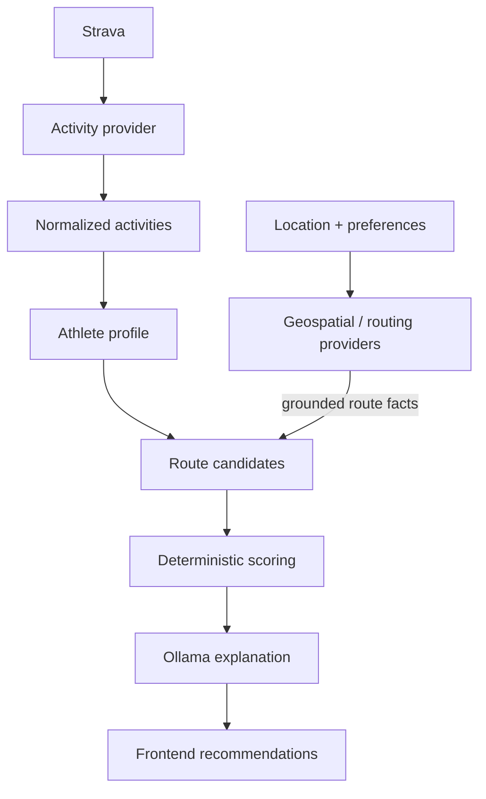

# Architecture

RouteMuse is a modular monolith with a typed Next.js UI, a FastAPI application, and PostgreSQL/PostGIS. Provider contracts form narrow seams around external systems.

## RouteMuse domain

RouteMuse owns the vocabulary used by the rest of the application: `ActivityKind`, normalized activities, `AthleteProfile`, `RouteCandidate`, and recommendation concepts. These models use canonical meters and seconds and must not mirror a provider payload merely for convenience. Presentation code owns user-facing unit conversion.

## Integration boundaries

**Location geocoding.** The existing `GeocodingProvider` contract exposes a multi-result search returning RouteMuse-owned `PlanningArea` values. A planning area carries validated WGS84 point coordinates, a display name, optional provider-supplied bounds, provider identification, and required attribution. Pelias FeatureCollections and provider field names remain inside the OpenRouteService adapter; raw payloads are neither exposed nor persisted. The API key is server-owned and checked only when search is invoked. The planner keeps the selected normalized value in component/session state and displays its attribution. Geocoding is available now, while route discovery, generation, and map rendering remain future work.

**Strava.** Strava is an external activity-data provider, not the owner of RouteMuse's taxonomy. The OAuth HTTP client and provider DTOs stay inside `backend/app/integrations/strava/`. The API initiates authorization, validates a short-lived HttpOnly state cookie, checks the actually granted `activity:read_all` scope, exchanges codes server-side, and exposes only token-free status. A centralized lifecycle service obtains usable access tokens and persists refresh-token rotation under a database row lock. The activity boundary classifies the provider's exact `sport_type` values through an explicit mapping; unsupported values retain their original provider value and do not produce a RouteMuse activity. The synchronization service converts required IANA-timezone calendar ranges into UTC provider bounds, retrieves typed pages sequentially, delegates token refresh to that lifecycle service, and commits idempotent upserts one page at a time. Provider-specific fields do not leak into domain logic. Athlete-profile requests are RouteMuse application endpoints: they query canonical persisted rows and never call Strava.

**Geospatial and routing providers.** External systems own factual trail and route information. Adapters normalize their geometry, coordinates, distance, elevation, surface, access, safety, and attribution facts into RouteMuse `RouteCandidate` models. Their implementations depend on small contracts, such as the protocols in `backend/app/integrations/contracts.py`, so a provider can be replaced without rewriting the domain.

**Ollama.** Ollama may reason over and explain already-grounded, structured candidates. It is downstream of factual providers and deterministic scoring. It is never authoritative for coordinates, route geometry, trail existence, distance, elevation, access restrictions, or safety conditions, and must not invent any of them.

## Application logic

Athlete capability, consistency, representative efforts, and other deterministic metrics belong to RouteMuse application/domain logic and must not depend on an LLM. These metrics are implemented by the provider-neutral athlete-profile service and exposed through `POST /api/v1/athlete-profile`. The API layer supplies persisted canonical facts and shared calendar boundaries; it does not recalculate metrics. Candidate feasibility and ranking are also primarily deterministic application logic, but are not implemented yet. This keeps future recommendations testable and ensures an explanation cannot alter the underlying route facts or score.

## Persistence

SQLAlchemy models, sessions, and repositories belong in the persistence layer outside the domain model. Domain concepts must remain usable in unit tests without a database and must not inherit from SQLAlchemy types. PostgreSQL/PostGIS stores application and geospatial data; Alembic owns schema evolution.

Because RouteMuse does not yet have application-user identities, selected planning areas are not persisted and will instead be carried into a future route-planning request. Strava persistence enforces one application-wide current connection; replacing the athlete removes the superseded local connection so it cannot resurface after disconnect. Imported activity facts use canonical meters and seconds, and durable synchronization-run metadata remains tied to its connection. Provider activity IDs are unique within a connection so repeated synchronization is idempotent. The original Strava `sport_type` is retained even when no RouteMuse activity kind is supported; the normalized kind is nullable in that case. Athlete profiles are derived on demand from these rows for a requested period; no profile table or duplicate derived state is stored. OAuth tokens are Fernet-encrypted before being bound to database columns, using the environment-provided `STRAVA_TOKEN_ENCRYPTION_KEY`; authorization codes and full provider payloads are not stored. If persistence fails after token exchange, the newly issued access token is revoked as a compensating action. Disconnect uses Strava's recommended revocation endpoint and removes local credentials only after the provider confirms revocation. Callback query strings are redacted from the application server's access-log scope so authorization codes are not logged.

## Architectural rules

1. Strava is an activity-data provider, not the owner of the application's taxonomy.
2. RouteMuse owns normalized activity data and maps provider payloads at integration boundaries.
3. Replaceable route providers exclusively supply factual geometry, distance, elevation, surface, and attribution.
4. Athlete analysis is deterministic application logic.
5. Candidate feasibility and scoring are deterministic application logic.
6. Ollama may explain already-grounded candidates through schema-validated output. It must never invent route facts or geometry.
7. Persistence concerns remain outside RouteMuse domain models.
8. External implementations remain replaceable through small provider contracts.

The application contains deterministic, provider-neutral athlete analytics for supported historical activities, including dominant activity, representative capability, and consistency/recency signals by RouteMuse activity kind. The versioned RouteMuse API and planner now expose this profile from persisted history. It contains no route scoring or LLM calls. The live Strava integration provides OAuth connection and token lifecycle behavior, a pure provider-to-domain activity normalization boundary, and synchronous historical activity synchronization with durable completed, partial, or failed run metadata.
