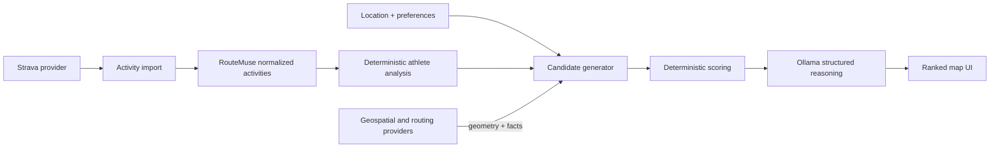

# Architecture

RouteMuse is a modular monolith with a typed Next.js UI, a FastAPI application, and PostgreSQL/PostGIS. Provider contracts form narrow seams around external systems.

## Boundaries

1. Strava is an activity-data provider, not the owner of the application's taxonomy.
2. RouteMuse owns normalized activity data and maps provider payloads at integration boundaries.
3. Replaceable route providers exclusively supply factual geometry, distance, elevation, surface, and attribution.
4. Athlete analysis is deterministic application logic.
5. Candidate feasibility and scoring are deterministic application logic.
6. Ollama may explain already-grounded candidates through schema-validated output. It must never invent route facts or geometry.
7. External implementations remain replaceable through the small provider protocols in `backend/app/integrations/contracts.py`.

Meters and seconds are canonical internal units. Presentation code is responsible for user-facing conversion. The scaffold deliberately contains no live adapters, analytics, scoring, or LLM calls.
